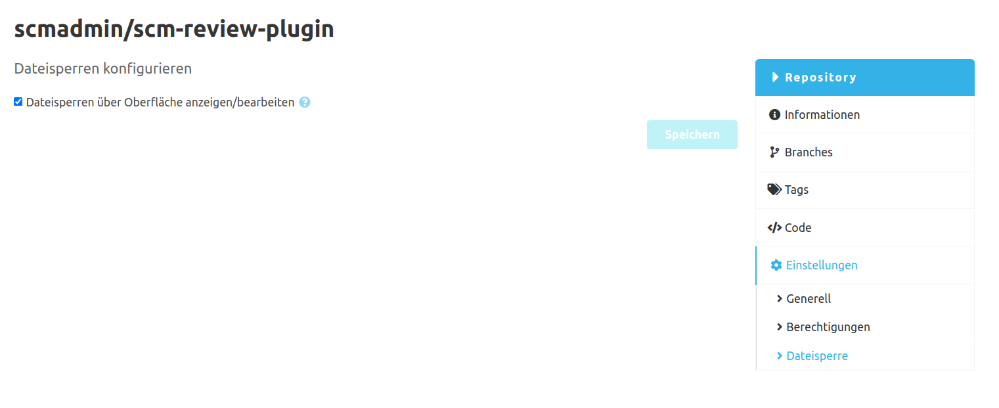

Die Konfiguration besteht derzeit nur aus der Option, File-Locks über die Oberfläche pro Repository zu deaktivieren.
Das Deaktivieren führt dazu, dass keine File-Locks mehr in der Oberfläche angezeigt oder verändert werden können.
File-Locks auf der Kommando-Ebene können damit **nicht** verhindert werden!

