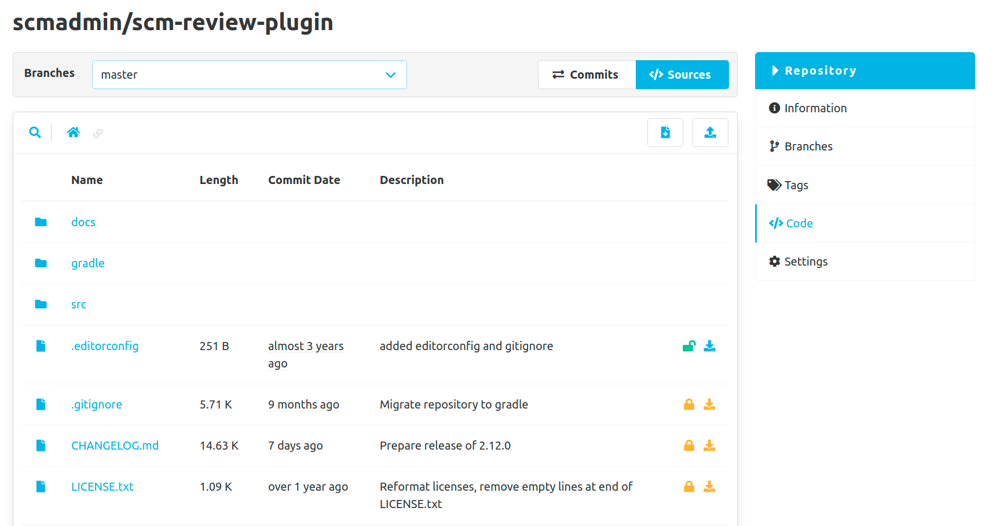
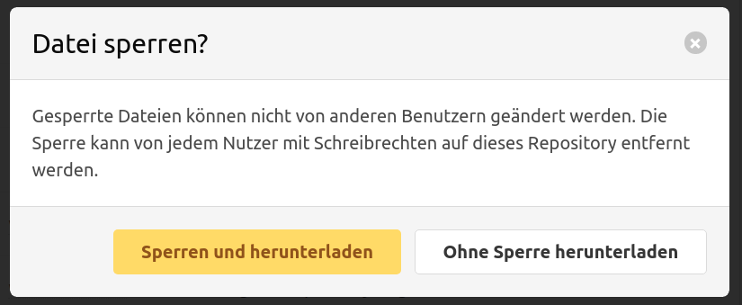
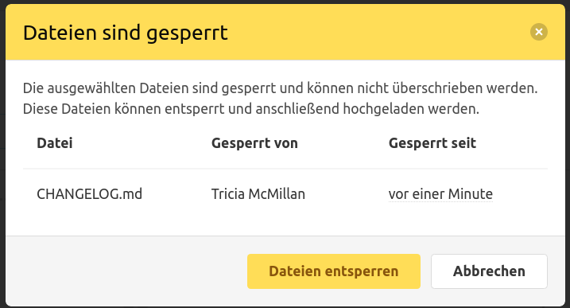

Das File-Lock-Plugin erlaubt es, Dateien zu sperren und damit vor Änderungen von anderen Benutzern zu schützen.
Gesperrte Dateien können nur noch vom dem Ersteller der Sperre bearbeitet werden. 
Die Sperre ist allerdings nicht geschützt und kann von jedem Benutzer mit Schreibrechten auf das Repository entfernt und neu gesetzt werden.

Das File-Lock-Plugin funktioniert am besten in Kombination mit dem [Editor-Plugin](/plugins/scm-editor-plugin/). 
Im Editor-Plugin können Dateien direkt heruntergeladen werden. Sind Dateien gesperrt, wird diese Download-Aktion gelb markiert.
Ist eine Datei nicht gesperrt, kann diese optional beim Herunterladen gesperrt werden.

Wird versucht Dateien über das Editor-Plugin hochzuladen, greift hier eine Validierung und es erscheint ein Modal,
sobald eine oder mehrere der ausgewählten Dateien gesperrt sind. 
Dies verhindert ein versehentliches Überschreiben von Dateien, die gerade von einem anderen Benutzer bearbeitet werden.
Alle Datei-Sperren, die das Hochladen verhindern, können in dem Modal direkt entsperrt werden.

