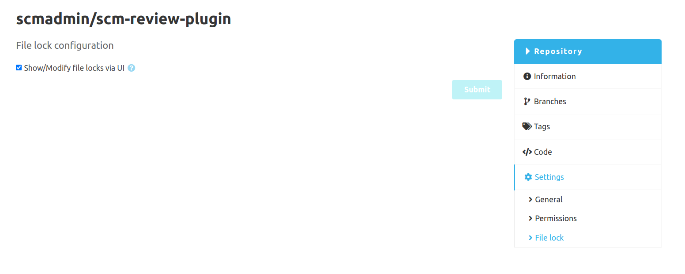

The configuration currently only exists to disable the file-lock support for the UI per repository. 
If you don't want to use this feature in certain repositories you can deactivate it here. 
This does **not** prevent the file locks via the native commands!

