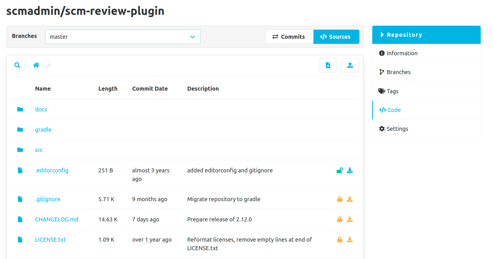
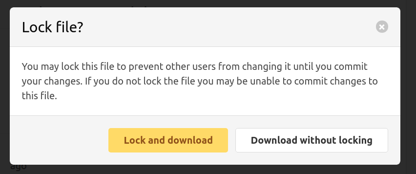
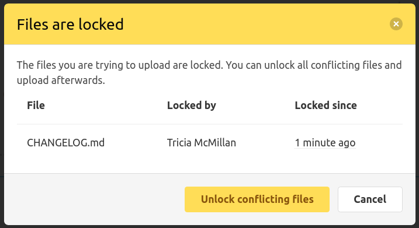

The File Lock Plugin allows you to lock files and thus protect them from changes by other users.
Locked files can only be edited by the creator of the lock.
However, the lock is not protected and can be removed and reset by any user with write permissions to the repository.

The File Lock plugin works best in combination with the [Editor Plugin](/plugins/scm-editor-plugin/).
In the Editor Plugin files can be downloaded directly. If files are locked, this download action is marked yellow.
If a file is not locked, it can optionally be locked during download.

If an attempt is made to upload files via the Editor Plugin, a validation takes effect here and a modal appears,
as soon as one or more of the selected files are locked.
This prevents accidental overwriting of files that are currently being edited by another user.
All file locks that prevent uploading can be unlocked directly in the modal.

